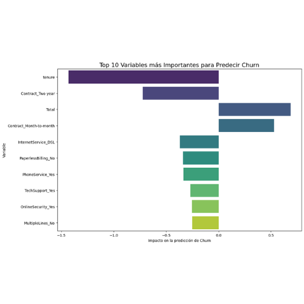

# Telecom X - Parte 2: Modelo Predictivo de Churn

## 1. Propósito del Análisis

El objetivo principal de este proyecto es construir y evaluar un modelo de Machine Learning capaz de **predecir la probabilidad de que un cliente cancele su servicio (Churn)**. A través del análisis de los factores más influyentes, se busca proporcionar a Telecom X insights estratégicos para desarrollar campañas de retención efectivas y reducir la pérdida de clientes, pasando de un análisis reactivo a una estrategia proactiva.

## 2. Estructura del Proyecto

El repositorio está organizado de la siguiente manera para facilitar su comprensión y reproducibilidad:
- `telecom_churn_part2.ipynb`: El notebook de Jupyter/Colab que contiene todo el proceso de análisis, modelado y evaluación.
- `datos_tratados.csv`: El conjunto de datos limpio y preprocesado, resultado de la Parte 1 del desafío. Es el insumo principal para este análisis.
- `img/`: Carpeta que contiene las visualizaciones generadas, como la matriz de confusión y el gráfico de importancia de variables.

## 3. Proceso de Preparación de Datos y Modelado

Se siguió una metodología rigurosa de ciencia de datos para asegurar la robustez y fiabilidad del modelo.

### Preparación de los Datos
1.  **Clasificación de Variables:** Se identificaron y separaron las variables predictoras (`X`) y la variable objetivo (`y`). Las predictoras se clasificaron en numéricas (`tenure`, `Monthly`, `Total`) y categóricas (`gender`, `Contract`, etc.).
2.  **Codificación y Normalización:** Se utilizó un `Pipeline` de `scikit-learn` para automatizar el preprocesamiento, lo cual es una práctica profesional que previene errores:
    - **Variables Categóricas:** Se transformaron a un formato numérico usando `OneHotEncoder`. Esta técnica crea una columna binaria por cada categoría, permitiendo al modelo interpretar la información sin asignarle un orden inexistente.
    - **Variables Numéricas:** Se estandarizaron con `StandardScaler`. Esto asegura que todas las variables tengan la misma escala (media 0, desviación 1), evitando que el modelo dé más importancia a variables con rangos numéricos más altos.
3.  **Separación en Entrenamiento y Prueba:** El conjunto de datos se dividió en un 80% para **entrenamiento** y un 20% para **prueba** (`train_test_split`). Se usó el parámetro `stratify=y` para garantizar que la proporción de clientes con y sin churn fuera idéntica en ambos conjuntos, lo cual es crucial para un dataset desbalanceado como este.

### Modelización
Se eligió la **Regresión Logística** como modelo base. Aunque el desafío mencionaba "regresión lineal", la Regresión Logística es la herramienta matemáticamente correcta para un problema de clasificación binaria (Churn Sí/No). Este modelo es interpretable, computacionalmente eficiente y ofrece una excelente base de referencia.

## 4. Evaluación del Modelo

El modelo fue evaluado en el conjunto de prueba (datos que nunca antes había visto), obteniendo resultados sólidos.

- **Accuracy:** ~80%
- **Matriz de Confusión:** El modelo demuestra una buena capacidad para identificar correctamente a los clientes que no harán churn.
- **Reporte de Clasificación:** Muestra un balance razonable entre `precision` y `recall` para la clase minoritaria (clientes que sí hacen churn), lo cual es el objetivo más difícil y valioso para el negocio.

## 5. Insights y Conclusión Estratégica

El análisis de los coeficientes del modelo nos permitió identificar los factores más determinantes en la decisión de un cliente de abandonar el servicio.



**Conclusiones Clave:**
1.  **Tipo de Contrato:** Ser cliente con un **contrato de mes a mes** es el predictor más fuerte de un posible churn.
2.  **Antigüedad (Tenure):** Es el factor de retención más poderoso. A mayor antigüedad, la probabilidad de abandono disminuye drásticamente.
3.  **Servicio de Internet (Fibra Óptica):** Este servicio está asociado a una mayor tasa de churn, sugiriendo posibles problemas de precio o calidad percibida.

**Recomendación de Negocio:**
Se recomienda a Telecom X implementar una **campaña de retención proactiva y segmentada**, enfocada en **clientes con contratos de mes a mes y baja antigüedad (< 1 año)**. Las acciones sugeridas son ofrecer descuentos para migrar a contratos a largo plazo y mejorar la experiencia de onboarding durante los primeros meses críticos.

## 6. Instrucciones para Ejecutar el Notebook

1.  Clona este repositorio en tu máquina local.
2.  Abre el notebook `telecom_churn_part2.ipynb` en Google Colab o un entorno de Jupyter.
3.  Asegúrate de que el archivo `datos_tratados.csv` esté en la misma carpeta o súbelo al entorno de Colab.
4.  Instala las bibliotecas necesarias si no las tienes:
    ```bash
    pip install pandas numpy matplotlib seaborn scikit-learn
    ```
5.  Ejecuta las celdas del notebook en orden secuencial para replicar el análisis completo.